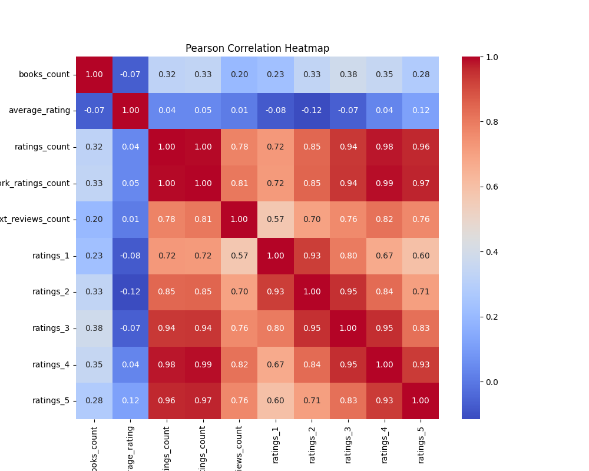
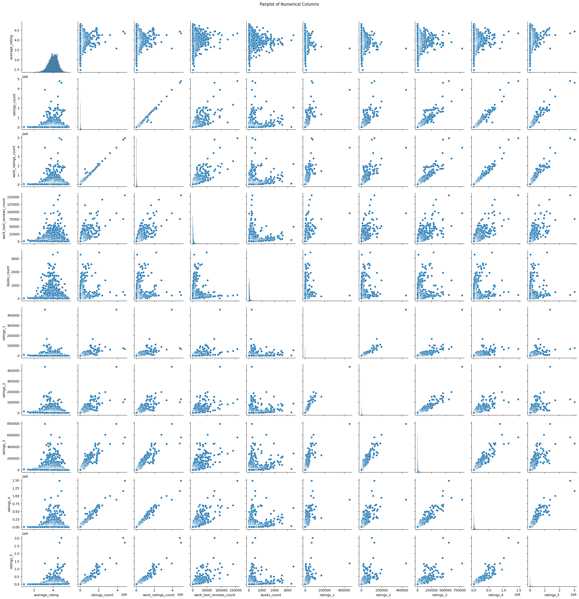
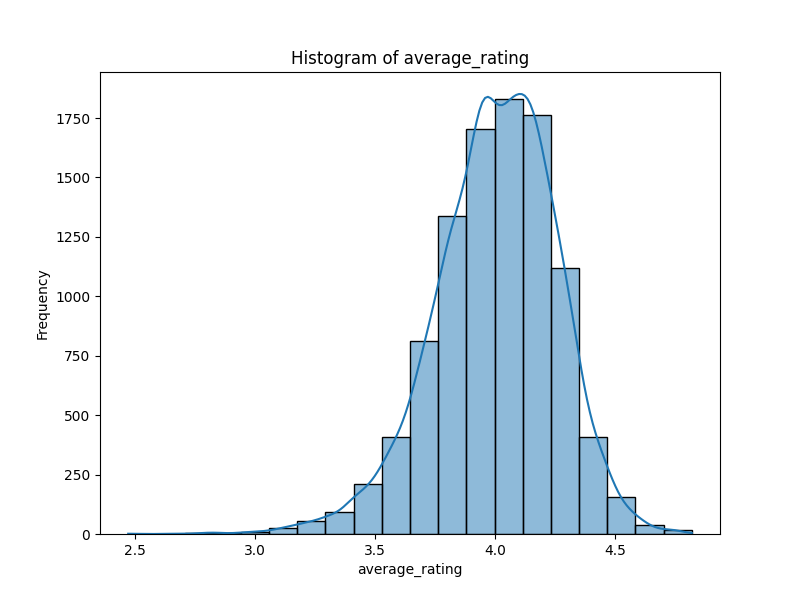
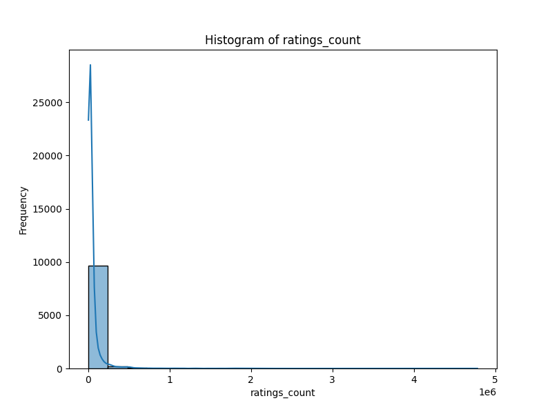
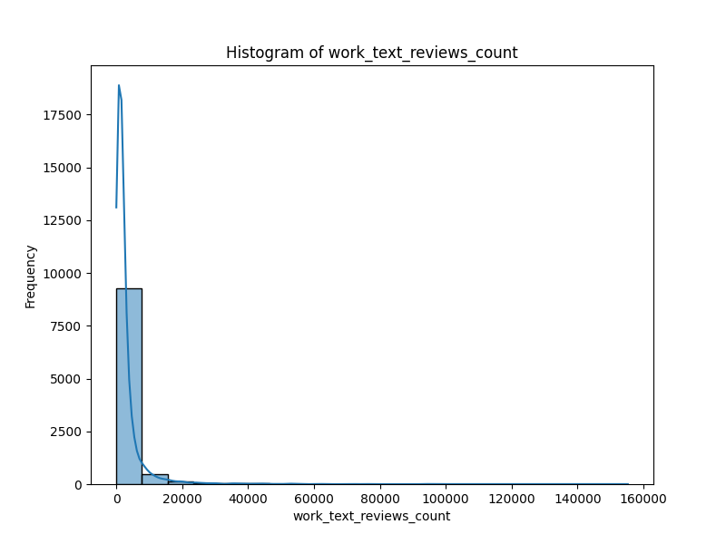
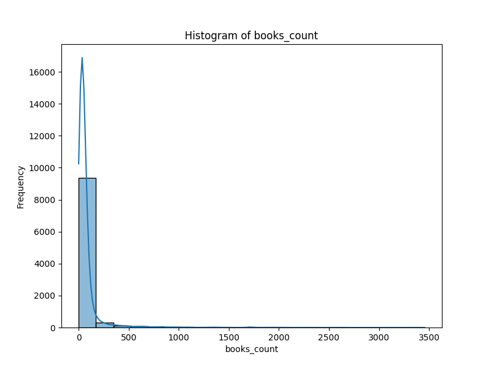
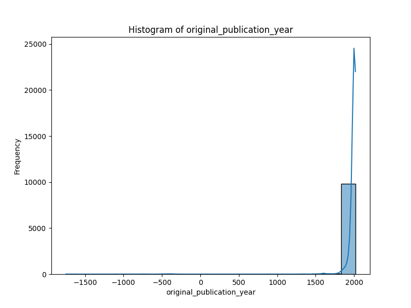

# Project Overview

## EDA Summary

### Business Summary of the Dataset

This summary provides an analysis of the dataset containing information about a collection of 10,000 books, showcasing key trends, significant patterns, and insights that can aid in informed business decisions.

#### Key Trends
1. **Diversity of Books**: The dataset comprises a wide range of books, with 9,300 unique ISBNs and 9,274 unique titles. This diversity suggests a broad appeal and a potentially extensive reader base.
2. **Average Ratings**: The average rating across the books is approximately 4.00, indicating a generally positive reception. The median rating aligns closely at 4.02, which reinforces this positive sentiment.

#### Significant Patterns and Outliers
1. **High Variance in Ratings Count**: The ratings_count feature shows a wide range with a mean of approximately 54,000 and a maximum of over 4.78 million. This indicates that while many books have modest engagement, a few bestsellers receive an exceptionally high volume of ratings. This skew can alert stakeholders to the importance of identifying and promoting high-performing titles.
2. **Authors' Popularity**: The dataset reveals that Stephen King is the most frequent author, with 60 entries, followed closely by Nora Roberts and Dean Koontz. This suggests that targeting similar authors for marketing and cross-promotional opportunities could be beneficial.

#### Dominant Categories and Their Implications
1. **Language Codes**: A significant portion of the dataset (6,341 books) is in English, indicating that the primary audience for these books is likely English-speaking. The presence of other language codes suggests potential markets but may warrant further analysis to understand the audience better.
2. **Publication Year Trends**: Most books in the dataset were originally published around the early 2000s, evidenced by the mean publication year being approximately 1982. This trend indicates a potential focus on contemporary and classic literature that may resonate with current market trends.

#### Issues with Missing Data
1. **Missing ISBN and ISBN13 Values**: There are 700 missing values for ISBN and 585 missing for ISBN13. This could impact inventory management and cataloging efforts, as missing identification numbers may prevent comprehensive listings and tracking in bookstore systems.
2. **Language Code Missing Values**: The language_code column has 1,084 missing values. This could restrict targeted marketing strategies, especially in multilingual regions, potentially leading to missed opportunities in those markets.

#### Additional Insights
1. **Rating Distribution**: Analysis of ratings shows a notable disparity in the number of ratings across different score categories. For instance, the mean for ratings_5 is significantly higher than ratings_1, hinting at a trend where most readership tends toward higher ratings.
2. **Outlier Handling**: The data exhibits significant outliers, particularly in ratings_count and work_ratings_count. Implementing data normalization techniques or careful selection criteria might enhance predictive modeling and analytics, ensuring businesses can more accurately forecast future book performances or marketing strategies.

#### Recommendations for Stakeholders
- **Focus on Bestsellers**: Given the high ratings and engagement observed, invest in marketing strategies for books with higher ratings counts and a positive reception. This may include targeted promotions, author events, or partnerships with popular authors.
- **Improve Data Completeness**: Prioritize addressing the missing values in the ISBN and language code variables to enhance cataloging accuracy and marketing reach.
- **Leverage Author Popularity**: Utilize the popularity of certain authors as a cornerstone for promotions or bundled offerings, potentially increasing sales by drawing on their established readership.

This summary translates the dataset statistics into actionable insights that stakeholders can leverage to enhance their decision-making processes and improve business outcomes related to book inventory management and marketing.

## EDA Visuals

