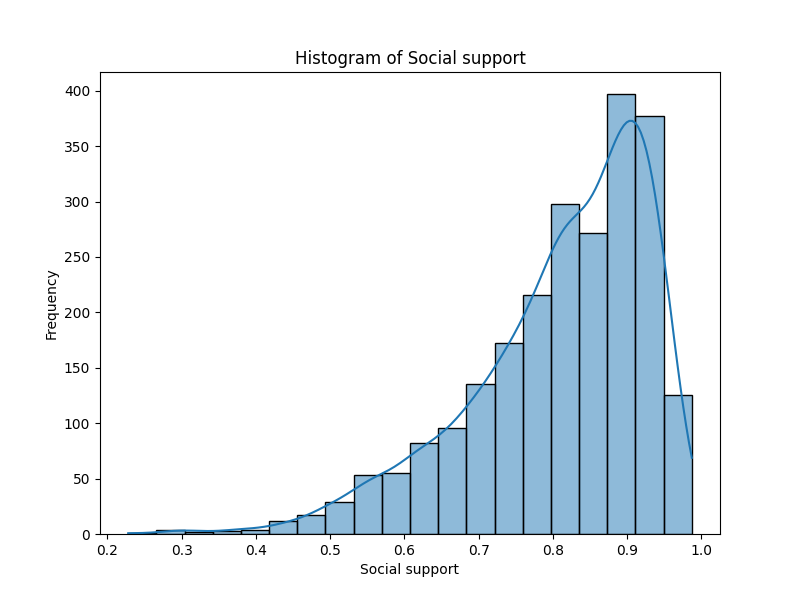

# Project Overview

## EDA Summary

**Business Summary of the Dataset Statistics**

**Key Trends:**
The dataset encompasses data from 2005 to 2023, with a total of 2,363 records representing various countries. The mean year of the dataset indicates a focus around 2014-2015, which could align with numerous global developments affecting well-being metrics. Notably, the dataset includes key indicators such as Life Ladder, Log GDP per capita, Social Support, Healthy Life Expectancy, Freedom to make life choices, Generosity, and perceptions of corruption.

**Significant Patterns and Outliers:**
1. **Life Ladder Scores**: The Life Ladder average score of approximately 5.48 suggests a moderate level of life satisfaction across the dataset. However, there are outliers with scores as low as 1.28, indicating potential areas of significant concern—ideally focusing policy or business interventions in these countries could yield positive results.
2. **Log GDP per Capita**: Strong correlation might be observed between GDP per capita and Life Ladder. An increase toward the maximum GDP per capita of 11.676 might often align with higher Life Ladder scores, impacting consumer behavior and market potential in developed nations.
3. **Generosity and Affective Well-being**: The mean generosity score is extremely low (near zero), with a median of -0.022 and notable negative values, suggesting that many individuals may feel less inclined towards charitable actions. This could indicate potential areas for social responsibility initiatives or marketing strategies that leverage community involvement.

**Dominant Categories and Groups:**
The top countries listed (e.g., Lebanon, Jordan, Nicaragua, Nepal, Moldova) each presenting 18 occurrences, highlight regions that might require focused market approaches. The prominence of these countries could also suggest specific cultural or economic similarities influencing well-being measures. Businesses targeting these markets might find particular success in aligning with the unique socio-economic fabrics of these nations.

**Issues with Missing Data:**
The dataset exhibits missing values in several key variables; for instance:
- **Log GDP per capita** has 28 missing entries.
- **Social Support** and **Healthy Life Expectancy** have 13 and 63 missing values, respectively.
- **Perceptions of Corruption** contains 125 missing values, which is significant.
Missing data may distort insights and hinder effective decision-making. Data imputation methods or targeted data gathering might be necessary to fill these gaps to provide a more comprehensive view for stakeholders.

**Additional Insights:**
1. **Correlational Analysis**: Emphasis on performing correlation analyses between these metrics could reveal strong interdependencies (e.g., examining if higher GDP correlates with improved social support or life satisfaction). Such insights can inform strategic planning and resource allocation.
2. **Temporal Shifts**: Examining changes over years—especially towards the latter years of the dataset—may help to determine if life satisfaction is improving. Stakeholders could utilize insights from recent trends to forecast future consumer behavior.
3. **Cultural Factors**: The data suggests that cultural dimensions might play a significant role in perceptions of well-being, as indicated by varying scores across countries. Understanding these cultural contexts can help in tailoring product offerings and marketing strategies.

In conclusion, businesses operating in or entering international markets can utilize these insights to drive strategies spanning from market entry to community investment initiatives, thus aligning organizational objectives with measurable societal impacts.

## EDA Visuals

