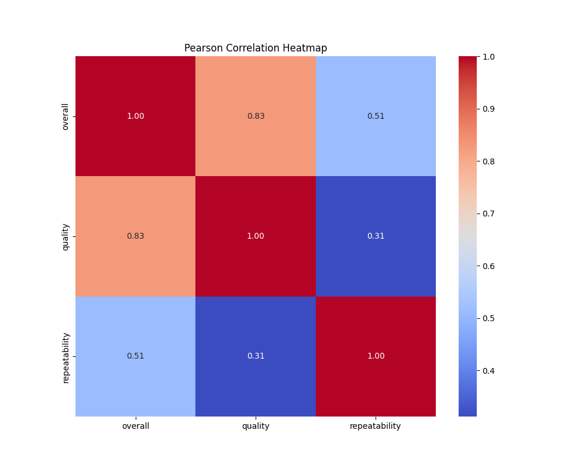
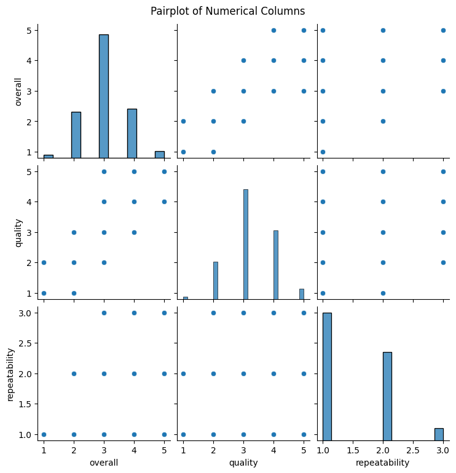
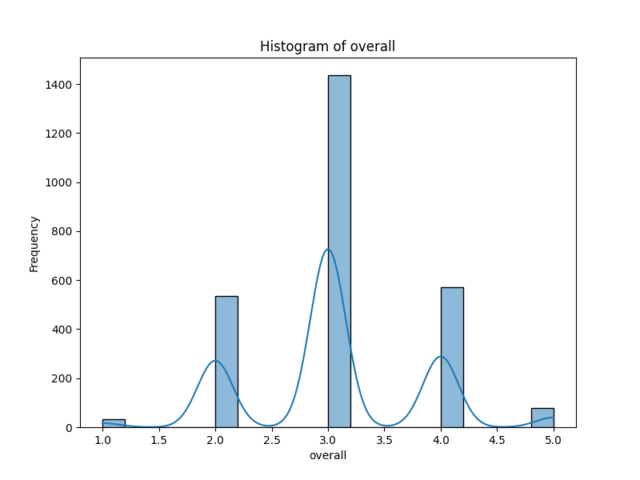
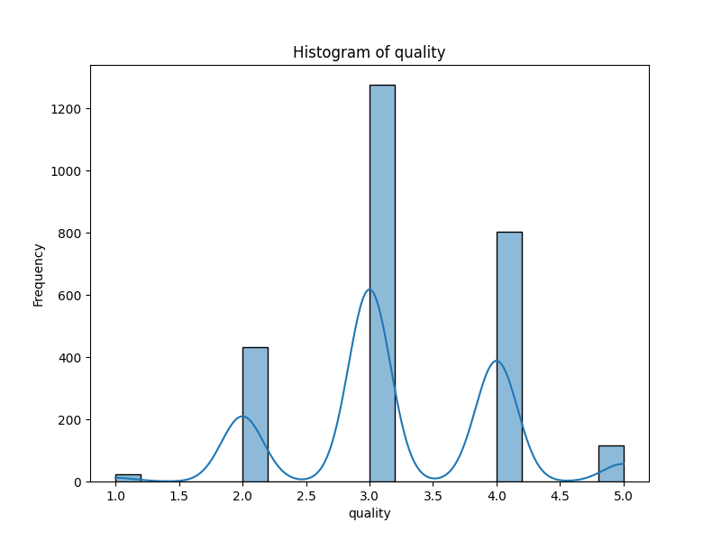
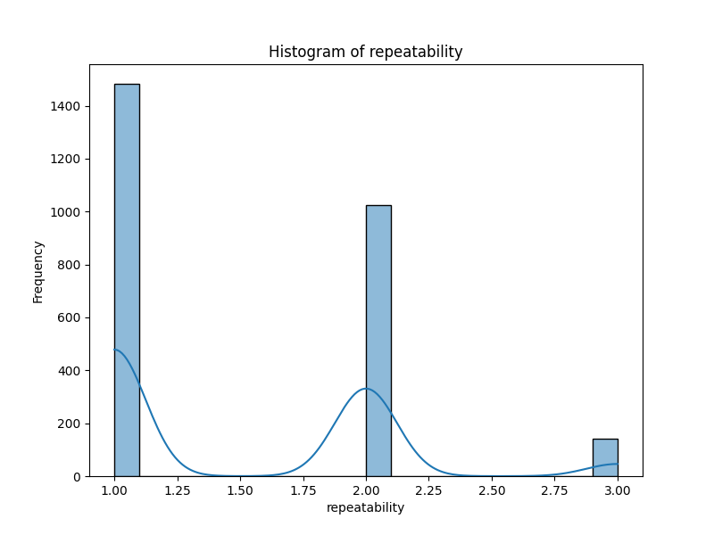

# Project Overview

## EDA Summary

### Summary of Dataset Analysis

#### Key Trends
1. **Temporal Distribution**: The dataset spans over a considerable timeframe with a total of 2,055 unique dates, indicating a lengthy observation period. However, with 99 missing entries, there could be gaps in the data that affect temporal analyses.
2. **Language Proficiency**: English is the dominant language, constituting approximately 49% of the total entries, suggesting a significant preference or target demographic for English-speaking audiences. This may have implications for marketing and content localization strategies.
3. **Content Type Dominance**: The dataset is heavily skewed towards movies, with 83.4% of entries classified as such. This suggests the need for businesses to focus their resources on film-related content, given its popularity.
4. **Rating Metrics**: The overall mean and median ratings (mean: 3.05 and median: 3.0) suggest a generally lukewarm reception across the board. The quality ratings (mean: 3.21, median: 3.0) indicate marginally higher perceptions of quality, but both metrics are centered around the mid-range of their respective scales.

#### Significant Patterns and Outliers
1. **Outlier Analysis**: While there are no explicit outliers in terms of ratings (given the constrained scale of 1-5), the significant frequency of certain titles such as "Kanda Naal Mudhal" suggests this could be a popular title warranting further investigation into its success factors.
2. **Authorship Concentration**: Kiefer Sutherland's prevalence (48 entries) shows an exceptional engagement with content related to him, which could indicate his brand's strong marketability or viewer loyalty. Exploring partnerships or productions involving him could yield positive outcomes.

#### Dominant Categories
- **Language**: The predominance of English, Tamil, and Telugu indicates a diverse demographic; however, English content significantly surpasses others. This suggests that businesses focusing on English-language content may have a competitive advantage in reaching a broader audience.
- **Content Type**: The overwhelming representation of movies (2,211 entries) vs. other types such as TV series (112) and non-fiction (60) indicates a strong consumer preference for theatrical films. There’s potential to expand into associated content forms (e.g., series adaptations) to capitalize on this fandom.

#### Missing Data Issues
- The dataset shows a notable 99 missing entries in the "date" column and 262 missing entries in "by." These gaps could skew trend analyses and affect stakeholder decisions if not addressed. The absence of data may lead to misinterpretations of content popularity and performance; thus, it's crucial to consider implementing better data collection measures to enhance robustness.

#### Additional Insights
- **Repeatability Ratings**: The mean around 1.49 indicates that most titles are not seen multiple times, which may reflect consumer satisfaction or content fatigue. Businesses could explore the reasons behind this low repeatability – whether it's content quality, limited appeal, or availability of new content. Reviewing the types and genres that yield higher repeatability could guide future content development strategies.
- **Quality Ratings Distribution**: The distribution of quality ratings suggests that while the average isn't high, significant segments fall within the "3" to "4" range of ratings. This could help inform marketing campaigns that target this mid-range audience, potentially leading to improved customer satisfaction and loyalty.

In conclusion, this dataset provides crucial insights into language preferences, content types, and audience engagement metrics—vital for strategic decision-making in content production and marketing. Stakeholders should focus on addressing missing data gaps, leveraging patterns around popular titles, and considering consumer engagement strategies to cater to the identified audience preferences.

## EDA Visuals

